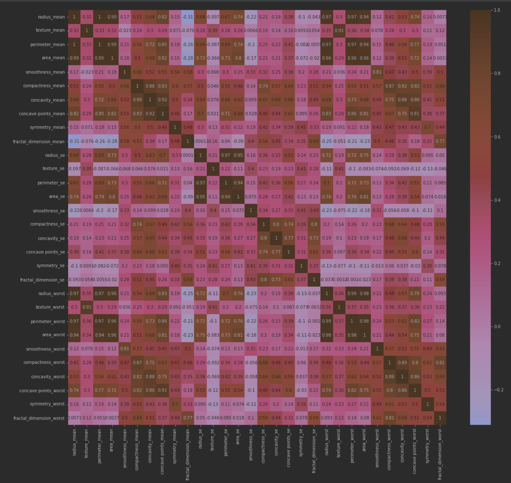
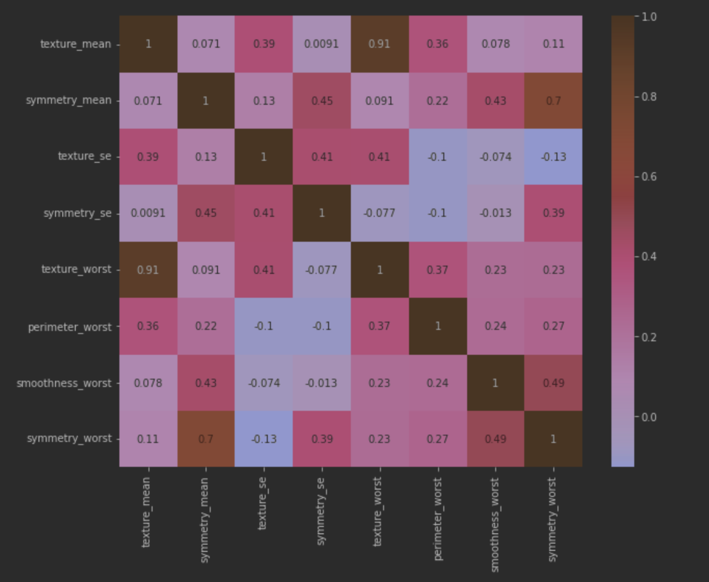
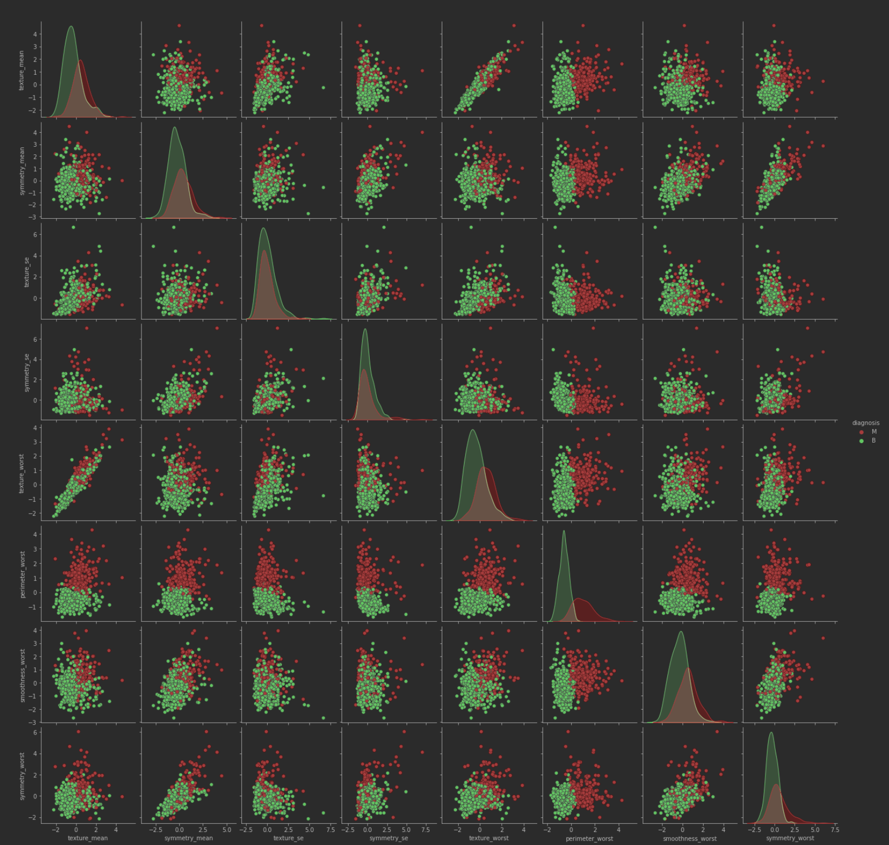
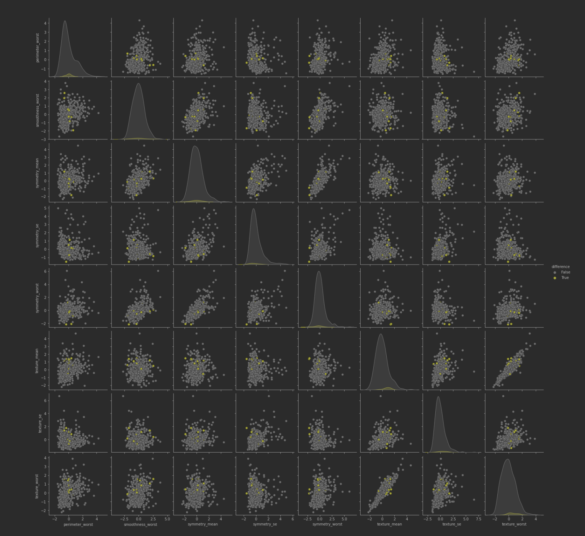
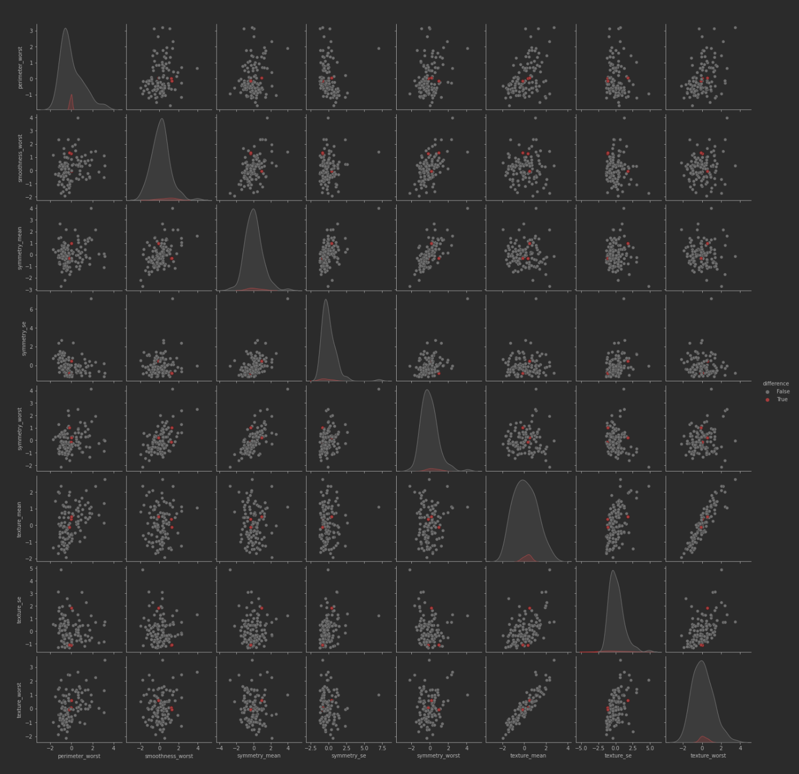

# Objective

Practice and compare the usage of different classification methods on a simple dataset.

# Technology

For this project we'll use mainly [scikit-learn](https://scikit-learn.org/), the code is available at [Github](https://github.com/NPGiorgi/mlucu/blob/main/breast_cancer/breast_cancer.ipynb).

# Algorithm

## Logistic Regression

[Logistic regression](https://scikit-learn.org/stable/modules/linear_model.html#logistic-regression), despite its name, is a linear model for classification rather than regression. It [measures the relationship](https://en.wikipedia.org/wiki/Logistic_regression#Logistic_regression_vs._other_approaches) between the categorical dependent variable and one or more independent variables by estimating probabilities using a logistic function, which is the cumulative distribution function of logistic distribution.


## Support Vector Machines

[Support-vector machines](https://en.wikipedia.org/wiki/Support-vector_machine) (SVMs) are supervised learning models with associated learning algorithms that analyze data for classification and regression analysis.


## Linear Discriminant Analysis

[LDA](https://en.wikipedia.org/wiki/Linear_discriminant_analysis) is a generalization of Fisher's linear discriminant, a method used in statistics and other fields, to find a linear combination of features that characterizes or separates two or more classes of objects or events. The resulting combination may be used as a linear classifier, or, more commonly, for dimensionality reduction before later classification. 

# Dataset

The [dataset](https://www.kaggle.com/uciml/breast-cancer-wisconsin-data) includes information about several feature of breast tumors and its classification in either `Malignant` or `Benign` (target variable).

The dataset contains the following features:

* ID number
* Diagnosis (M = malignant, B = benign)
* Radius (mean of distances from center to points on the perimeter)
* Texture (standard deviation of gray-scale values)
* Perimeter
* Area
* Smoothness (local variation in radius lengths)
* Compactness (perimeter^2 / area - 1.0)
* Concavity (severity of concave portions of the contour)
* Concave points (number of concave portions of the contour)
* Symmetry
* Fractal dimension ("coastline approximation" - 1)

# Data Preparation

Let's first load the dataset and check some insights.

```python
import pandas as pd

df = pd.read_csv("./breast_cancer.csv")
df.describe()
```

We know there are not null values because it's on the dataset description, but still we need to scale the data for later usage.

```python
from sklearn.preprocessing import StandardScaler

# scale features
features = df.columns.difference(['diagnosis'])
df[features] = StandardScaler().fit_transform(df[features])
```

Let's now check the `Correlation Matrix`.

```python
correlation_matrix = df.corr()
plt.figure(figsize=(20,18))
sns.heatmap(correlation_matrix, annot=True)
```



We can see that there are several correlated parameters, this would make our model to perform poorly. Let's try to look into the features to choose the ones that best predict our target.

# Feature Selection

To select the most useful features we'll use PCA.

```python
from sklearn.decomposition import PCA

# apply PCA to see variance by feature
features = df.columns.difference(['diagnosis'])

pca = PCA(n_components=len(features))
pca.fit(df[features])
newdf = pd.DataFrame()
newdf["variance"] = pca.explained_variance_
newdf["headers"] = df[features].columns.values

# get actual variance by feature and store in deltas
variance_array = list(reversed(list(newdf["variance"])))
variance_by_feature = []
for index, variance in enumerate(variance_array):
    variance_by_feature.append(variance - sum(variance_by_feature))
newdf["deltas"] = variance_by_feature

# sort rows by variance, higher first
newdf.sort_values("deltas", ascending=False, inplace=True)
```

We get the following values:

| Acumm Variance | Feature                   | Variance Deltas |
| -------------- | ------------------------- | --------------- |
| 0,0001         | texture\_worst            | 7,6036          |
| 0,0008         | texture\_se               | 2,8785          |
| 0,0016         | texture\_mean             | 0,8388          |
| 0,0155         | symmetry\_mean            | 0,5331          |
| 0,0082         | symmetry\_se              | 0,4422          |
| 0,0069         | symmetry\_worst           | 0,3325          |
| 0,0181         | smoothness\_worst         | 0,1990          |
| 0,0527         | perimeter\_worst          | 0,0845          |
| 0,0275         | smoothness\_mean          | 0,0663          |
| 0,0595         | perimeter\_se             | 0,0630          |
| 0,0244         | smoothness\_se            | 0,0598          |
| 0,0300         | radius\_worst             | 0,0569          |
| 0,0312         | radius\_se                | 0,0328          |
| 0,0943         | fractal\_dimension\_worst | 0,0205          |
| 0,0496         | radius\_mean              | 0,0198          |
| 0,2616         | concavity\_worst          | 0,0184          |
| 0,0800         | perimeter\_mean           | 0,0143          |
| 1,2095         | compactness\_worst        | 0,0073          |
| 0,1573         | fractal\_dimension\_se    | 0,0068          |
| 0,4775         | concave points\_se        | 0,0063          |
| 1,9841         | compactness\_mean         | 0,0053          |
| 0,2418         | fractal\_dimension\_mean  | 0,0031          |
| 0,4176         | concave points\_worst     | 0,0031          |
| 0,6764         | concave points\_mean      | 0,0026          |
| 0,3513         | concavity\_mean           | 0,0025          |
| 1,6516         | compactness\_se           | 0,0013          |
| 0,2944         | concavity\_se             | 0,0012          |
| 2,8229         | area\_worst               | 0,0008          |
| 5,7014         | area\_se                  | 0,0006          |
| 13,3050        | area\_mean                | 0,0001          |

From this we'll only select the top eight features.

| Acumm Variance | Feature                   | Variance Deltas |
| -------------- | ------------------------- | --------------- |
| 0,0001         | texture\_worst            | 7,6036          |
| 0,0008         | texture\_se               | 2,8785          |
| 0,0016         | texture\_mean             | 0,8388          |
| 0,0155         | symmetry\_mean            | 0,5331          |
| 0,0082         | symmetry\_se              | 0,4422          |
| 0,0069         | symmetry\_worst           | 0,3325          |
| 0,0181         | smoothness\_worst         | 0,1990          |
| 0,0527         | perimeter\_worst          | 0,0845          |

Now the `Correlation Matrix` looks much better:



Let's look at how our features relate to the target variable.



We can observe than on some of the charts we can clearly draw a line were we can say than on one side the tumors are benign and on the other malignant (`symmetry_mean` vs `perimterer_worst`). But in some other features make it more difficult to tell (like `texture_mean` vs `texture_se`).

# Training the model

Let's first try with Logistic Regression.

```python
# fit data
logistic = LogisticRegression(n_jobs=-1)
logistic.fit(X_train, y_train)

print(f"Train Score: {logistic.score(X_train, y_train)}")
print(f"Test Score: {logistic.score(X_test, y_test)}")

# Train Score: 0.9736263736263736
# Test Score: 0.9649122807017544
```

And now with SVM.

```python
from sklearn.svm import SVC

svc = SVC()
svc.fit(X_train, y_train)

print(f"Train Score: {svc.score(X_train, y_train)}")
print(f"Test Score: {svc.score(X_test, y_test)}")

# Train Score: 0.9824175824175824
# Test Score: 0.956140350877193
```

We can also try with LDA.

```python
from sklearn.discriminant_analysis import LinearDiscriminantAnalysis

lda = LinearDiscriminantAnalysis()
lda.fit(X_train, y_train)


print(f"Train Score: {lda.score(X_train, y_train)}")
print(f"Test Score: {lda.score(X_test, y_test)}")

# Train Score: 0.9604395604395605
# Test Score: 0.956140350877193
```

# Conclusions

We got pretty much the same score with each of the algorithms. But let's look into the different results in the classifiers.

Train Predictions:

| DIAGNOSIS | LOGISTIC REGRESSION | SVC | LDA |
| --------- | ------------------- | --- | --- |
| M         | M                   | M   | B   |
| M         | M                   | B   | B   |
| M         | B                   | M   | B   |
| M         | B                   | M   | B   |
| M         | M                   | M   | B   |
| M         | M                   | M   | B   |
| M         | M                   | M   | B   |
| M         | M                   | M   | B   |
| B         | M                   | B   | B   |
| M         | B                   | M   | B   |
| M         | B                   | M   | B   |
| M         | M                   | M   | B   |



Test Predictions:

| DIAGNOSIS | LOGISTIC REGRESSION | SVC | LDA |
| --------- | ------------------- | --- | --- |
| M         | M                   | M   | B   |
| M         | M                   | B   | B   |
| B         | M                   | M   | B   |




We can see that LDA is mostly failing saying that tumors are benign while they are actually malignant. Logistic and SVC regression seems to fail to both sides. Either way we have really good scores on each algorithm.

