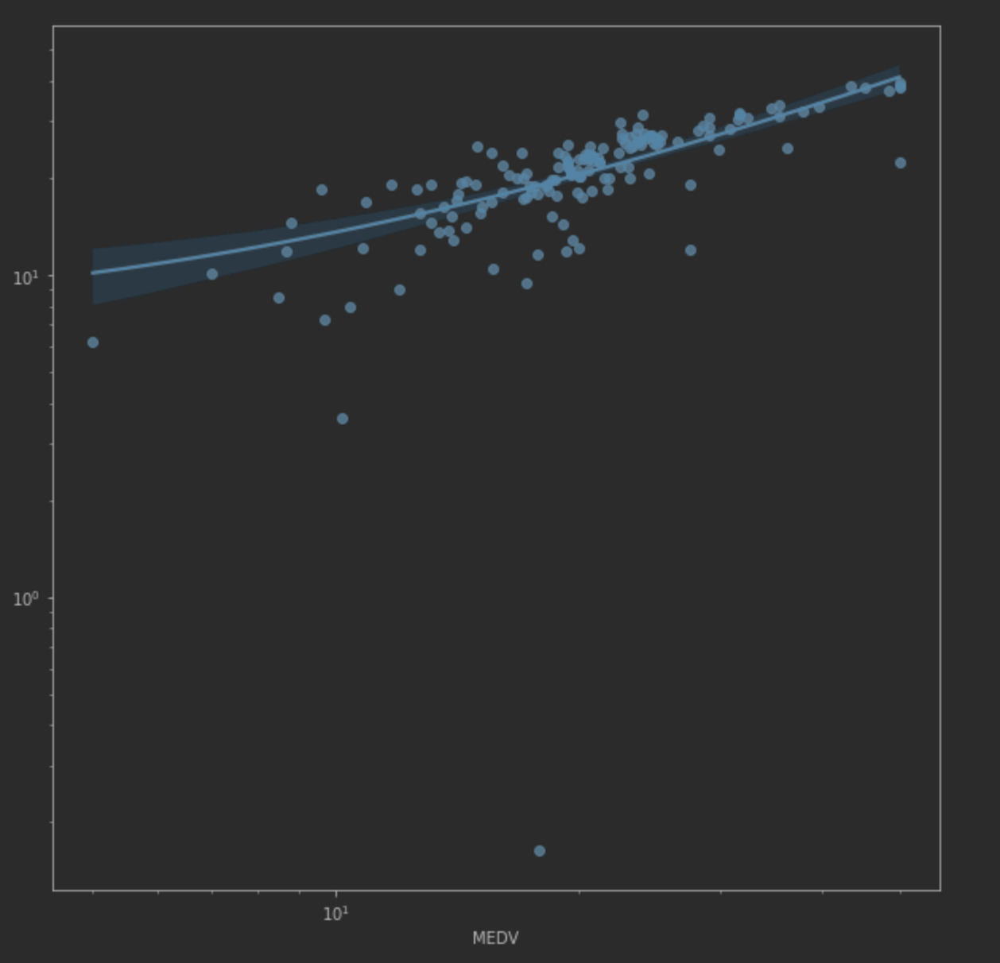
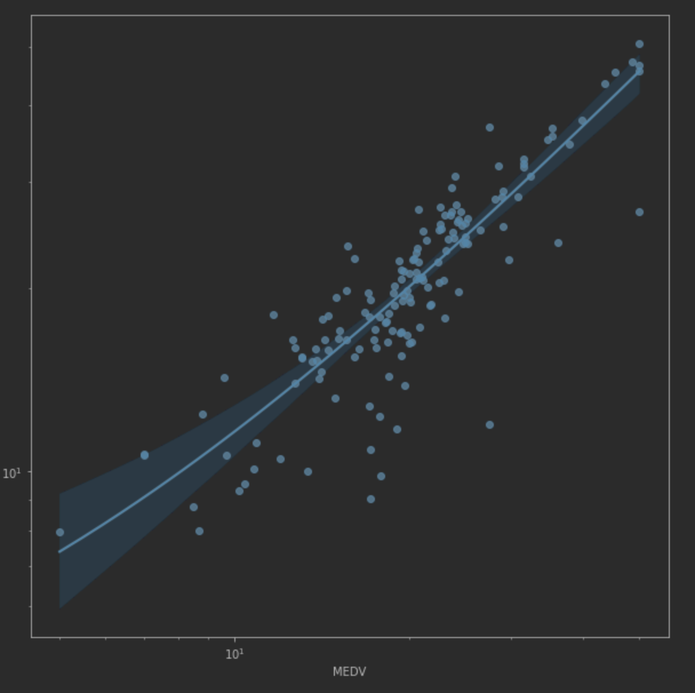
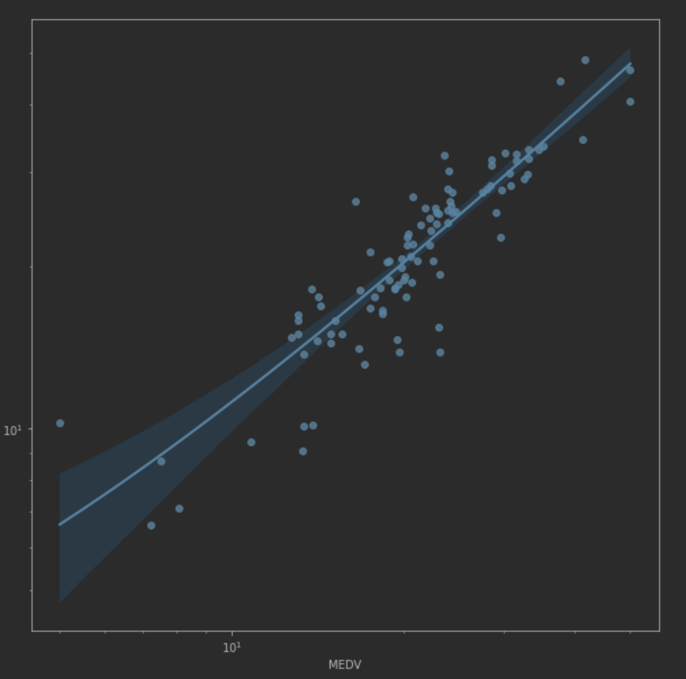

# Objective

Practice the usage of linear regression, see how different techniques applied to the dataset can land a more accurate prediction.

# Algorithm

[LinearRegression](https://scikit-learn.org/stable/modules/generated/sklearn.linear_model.LinearRegression.html) fits a linear model with coefficients w = (w1, …, wp) to minimize the residual sum of squares between the observed targets in the dataset, and the targets predicted by the linear approximation.

# Dataset

In this case we will be using the [Boston Housing Dataset](https://archive.ics.uci.edu/ml/machine-learning-databases/housing/). The dataset contains aggregated data of several suburbs in Boston, Massachusetts. The target variable will be the `MEDV` column.

The dataset contains the following features:

* CRIM - Per capita crime rate by town
* ZN - Proportion of residential land zoned for lots over 25,000 sq.ft.
* INDUS - proportion of non-retail business acres per town
* CHAS - Charles River dummy variable (= 1 if tract bounds river; 0 otherwise)
* NOX - nitric oxides concentration (parts per 10 million)
* RM - average number of rooms per dwelling
* AGE - proportion of owner-occupied units built prior to 1940
* DIS - weighted distances to five Boston employment centres
* RAD - index of accessibility to radial highways
* TAX - full-value property-tax rate per $10,000
* PTRATIO - pupil-teacher ratio by town
* LSTAT - % lower status of the population
* MEDV - Median value of owner-occupied homes in $1000's

# Technology

For this project we'll use mainly [scikit-learn](https://scikit-learn.org/), the code is available at [Github](https://github.com/NPGiorgi/mlucu/blob/main/houses/houses.ipynb).

# Data Cleanup

Let's start by loading the dataset.

```python
import pandas as pd

df = pd.read_csv("/path/to/housing.csv")
```

Now let's covert the feature values to the right type and apply `StandardScaler`.

```python
from sklearn.preprocessing import StandardScaler

features = df.columns.difference(["MEDV"])

df.convert_dtypes()

df[features] = StandardScaler().fit_transform(df[features])
```

# Feature Selection

For feature selection we'll use PCA.

| Acummulated Variance | headers | Introduced Variance |
| -------------------- | ------- | ------------------- |
| 0,06362        	   | ZN      | 4,700701            |
| 0,18643        	   | RM      | 0,387267            |
| 0,16954        	   | TAX     | 0,192572            |
| 0,27714        	   | PTRATIO | 0,177451            |
| 0,52886        	   | LSTAT   | 0,131321            |
| 0,39754        	   | NOX     | 0,130378            |
| 0,65924        	   | INDUS   | 0,120402            |
| 6,14012        	   | AGE     | 0,063617            |
| 0,83669        	   | DIS     | 0,056415            |
| 0,85958        	   | CRIM    | 0,034293            |
| 0,22073        	   | RAD     | 0,022882            |
| 1,24684        	   | CHAS    | 0,016893            |

In this case we'll use the top 5 features (after trying adding/removing seems to be the number that lands the best result):

* ZN
* RM
* TAX
* PTRATIO
* LSTAT

# Training the model

```python
from sklearn.model_selection import train_test_split, cross_val_score
from sklearn.linear_model import LinearRegression

features = df.columns.difference(["MEDV"])

X_train, X_test, y_train, y_test = train_test_split(df[features], df["MEDV"], test_size=0.30, shuffle=True, random_state=42)


lr = LinearRegression(n_jobs=-1)

scores = cross_val_score(lr, X_train, y_train, cv=10)

lr.fit(X_train, y_train)

test_score = lr.score(X_test, y_test)
```

Which lands the following score:

```
Training score: 0.6500236136614277
Test score: 0.6112302519836519
```




Not a great score, but a good starting point. We'll try to improve this score.

Let's train another model, but this time using Polynomial Features to see if this way we can achieve a modele that fits the data better.

```python
from sklearn.preprocessing import PolynomialFeatures
from sklearn.linear_model import LinearRegression
from sklearn.pipeline import make_pipeline

model = make_pipeline(PolynomialFeatures(degree=2), LinearRegression())

scores = cross_val_score(model, X_train, y_train, cv=10)

model.fit(X_train, y_train)

test_score = model.score(X_test, y_test)
```
Which lands us the following score:

```
Training score: 0.7741571477196598
Test score: 0.8091669221662323
```



We are doing better now, but maybe we can try something else to improve it. If you look at the charts you will see values that are far away of the model. This are outliers, we can try to detect them and train the model again.

For detecting outliers we'll use `LocalOutlierFactor` which will use KNN to score the each value in order to see how isolated they are. 

```python
from sklearn.neighbors import LocalOutlierFactor

features = df.columns.difference(["MEDV"])

# Using 20 because it seem to land the best result
outliers = LocalOutlierFactor(n_neighbors=20).fit_predict(df)
print(f"Outliers found: {len([x for x in outliers if x == -1])}")

# remove outliers and outlier column
df["OUTLIER"] = outliers
df.drop(df[df.OUTLIER == -1].index, inplace=True)
df.drop(["OUTLIER"], inplace=True, axis=1)
```

Now we can train our model again, which lands the following result:

```
Training score: 0.8361320453479205
Test score: 0.8594674840253899
```



# Conclusion

Linear regression is an easy algorithm to use. It doesn't have hyper parameters to tune, so it's usable out of the box. Still it requires careful dataset handling and cleaning in order to get a good prediction. Using polynomial features allows us to get a better fit to the data that we could achieve simply by using linear models. But also increasing the grade of the polynomial features can easily make the model overfit.