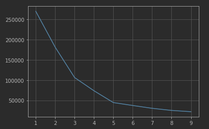

# Objective

Using K-Means to find clusters of clients inside the dataset containing information of the clients of a mall.

# Algorithm

In this case we'll use the K-Means algorithm. K-Means clusters data by separating them in disjoint clusters of equal variance while minimizing a criterion (usually Euclidian Distance). The algorithm also requires us to know in advance the number of cluster we want to divide the data into. There are several techniques that can help us determine this number.

# Dataset

In this case we'll use the [Mall Customers](./mall.csv) dataset. The dataset contains information about the customers of a mall, including its spending score.

The dataset contains the following features:

* Customer ID: Identifier of the customer
* Gender: Male/Female
* Age: Age of the customer
* Annual Income: Annual income of the customer (thousands of dollars).
* Spending Score: Score assigned by the mall based on customer behavior and spending nature

# Data Preparation

The dataset es mostly ready for use, but let's load the data, see some stats, and check for missing values.

```python
import pandas as pd

df = pd.read_csv("./mall.csv")
df.describe()
```

| stat  | customer\_id | age    | annual\_income | spending\_score |
| ----- | ------------ | ------ | -------------- | --------------- |
| count | 200,00       | 200,00 | 200,00         | 200,00          |
| mean  | 100,50       | 38,85  | 60,56          | 50,20           |
| std   | 57,88        | 13,97  | 26,26          | 25,82           |
| min   | 1,00         | 18,00  | 15,00          | 1,00            |
| 25%   | 50,75        | 28,75  | 41,50          | 34,75           |
| 50%   | 100,50       | 36,00  | 61,50          | 50,00           |
| 75%   | 150,25       | 49,00  | 78,00          | 73,00           |
| max   | 200,00       | 70,00  | 137,00         | 99,00           |

In this case we'll only be using two features to train the model, the ones we most care about:

```python
X = df[["annual_income", "spending_score"]]
```

# Selecting number of clusters

To select the right amount of clusters we can use the `Elbow Method`. The `Elbow Method` is an heuristic that consist in plotting the variation as a function of the number of clusters and then picking the elbow of the curve as the number of cluster to use.

```python
from sklearn.cluster import KMeans

number_of_clusters = range(1, 10)
distorsions = []

for k in number_of_clusters:
    kmeans = KMeans(n_clusters=k, random_state=45)
    kmeans.fit(X)
    distorsions.append(kmeans.inertia_)
```



As we can see there is a breaking point around the number of clusters of five, so we'll use five as the chosen number of clusters.

# Training the model

```python
chosen_number_of_cluster = 5
kmeans = KMeans(n_clusters=chosen_number_of_cluster, random_state=45)
kmeans.fit(X)
df["cluster"] = kmeans.predict(X)
```
This will add a column `cluster` with the number of the cluster the client was assigned.

# Conclusions

We can take a look into each of the feature colored by their cluster number.


We can see that the two features we trained (`annual_income`, `spending_scode`) have very clearly identifiable clusters. Let's take a more closer look to this chart.


We can see that there are two interesting groups, customers with a high annual income and a high spending score and customers with a low annual income and a high spending score. From these two its probably more interesting the ones with high income, as there is more room for them to expend more money, so they would be a good target for marketing campaign.
